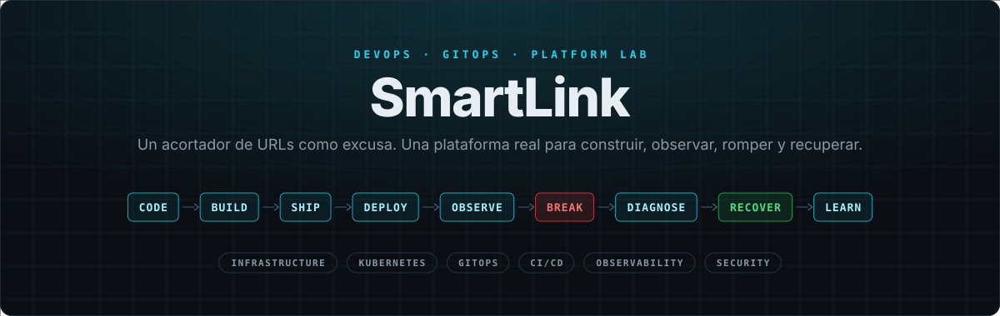

<div align="center">



<br>

[](../../actions/workflows/ci.yaml)


**[Instalación](docs/es/install.md)** · **[Labs](#-labs)** · **[Break the Platform](docs/es/break.md)** · **[El stack](docs/es/stack.md)** · **[Arquitectura](docs/es/architecture.md)** · **[Referencias](docs/es/references.md)** · **[Toda la documentación](docs/es/README.md)**

[English](README.md) · **Español**

</div>

## ⚡ La idea

**SmartLink no es un acortador de URLs: es un laboratorio de plataforma que usa uno como excusa.** Lo construís, lo desplegás, lo observás, lo rompés y lo recuperás, llevando a la práctica la metodología DevOps: CI/CD, Kubernetes, GitOps y servicios desacoplados.

> [!NOTE]
> Instalado y probado de punta a punta en una VM local (Multipass en macOS).

## 🧱 Stack

**Aplicación**<br>
&nbsp;&nbsp;&nbsp;

**Plataforma**<br>
&nbsp;&nbsp;&nbsp;&nbsp;&nbsp;

**Bootstrap**<br>
&nbsp;&nbsp;&nbsp;

**Observabilidad**<br>
&nbsp;&nbsp;

**Seguridad**<br>
&nbsp;

## 🏗 Arquitectura


GitHub Actions **nunca** toca el cluster: cambia Git, y Argo CD, desde adentro, hace el resto.

## 🧪 Labs

| # | Lab | Aprendés |
| --- | --- | --- |
| 01 | [Aplicación](docs/es/labs/01-application.md) | API stateless, fail-fast, 503 vs. 500 |
| 02 | [Cloudflare D1](docs/es/labs/02-d1.md) | Migraciones versionadas y aditivas |
| 03 | [Docker](docs/es/labs/03-docker.md) | Imágenes sin root, read-only, multi-arch |
| 04 | [K3s](docs/es/labs/04-k3s.md) | get → describe → logs, reconciliación |
| 05 | [Scripts de instalación](docs/es/labs/05-scripts.md) | Bootstrap vs. GitOps, idempotencia |
| 06 | [Argo CD](docs/es/labs/06-argocd.md) | Desired vs. live, ApplicationSet |
| 07 | [Vault + VSO](docs/es/labs/07-vault.md) | Kubernetes auth, policies, secretos fuera de Git |
| 08 | [GitHub Actions + GHCR](docs/es/labs/08-github-actions.md) | SHA vs. semver, release sin rebuild |
| 09 | [GitOps](docs/es/labs/09-gitops.md) | Drift y selfHeal |
| 10 | [DNS & Ingress](docs/es/labs/10-dns-ingress.md) | Triage por capas |
| 11 | [Observabilidad](docs/es/labs/11-observability.md) | LogQL, eventos de Kubernetes |
| 12 | [Rollback](docs/es/labs/12-rollback.md) | `git revert` y migraciones |

## 💥 Break the Platform

11 fallas reales, provocadas a propósito: **provocar → qué ves → dónde mirar → causa → arreglo → lección.**

`ImagePullBackOff` · `CrashLoopBackOff` · GitOps drift · falla de D1 · migración fallida · bad release · DNS/Ingress · Vault sellado · role incorrecto · policy incorrecta · secret faltante → [escenarios](docs/es/break.md)

## 🚀 Empezar

**Necesitás:** una VM Linux (o tu Mac), una cuenta de GitHub y una de Cloudflare.

```bash
git clone git@github.com:<vos>/<tu-repo>.git && cd <tu-repo>
./scripts/install.sh    # te guía paso a paso: en una Mac primero crea la VM
```

<a href="docs/es/install.md"></a>
<a href="docs/es/README.md"></a>

<details>
<summary><b>Estructura del repositorio</b></summary>

```text
backend/  frontend/   App (FastAPI + Streamlit) con sus Dockerfiles
migrations/           Schema de D1, versionado
scripts/              Bootstrap: install.sh (guiada) · uninstall.sh
deploy/root/          ApplicationSet + AppProject: una Application por carpeta de components/
deploy/components/    Una carpeta por componente: Chart.yaml (versión) · values.yaml · templates/
.github/workflows/    ci.yaml
docs/                 Documentación: inglés (docs/) y español (docs/es/)
```

</details>
