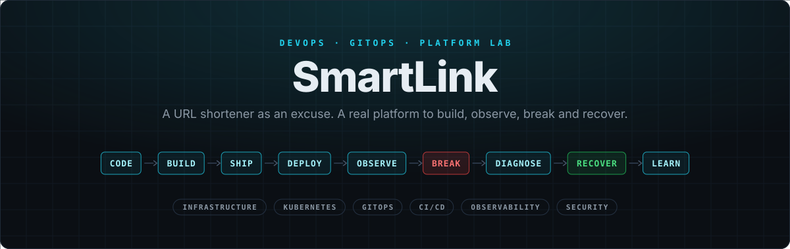

<div align="center">



<br>

[](../../actions/workflows/ci.yaml)


**[Install](docs/install.md)** · **[Labs](#-labs)** · **[Break the Platform](docs/break.md)** · **[The stack](docs/stack.md)** · **[How it works](docs/architecture.md)** · **[References](docs/references.md)** · **[All docs](docs/README.md)**

**English** · [Español](README.es.md)

</div>

## ⚡ The idea

**SmartLink is not a URL shortener: it is a platform lab that uses one as an excuse.** You build it, deploy it, observe it, break it and bring it back, putting DevOps practices to work: CI/CD, Kubernetes, GitOps and decoupled services.

> [!NOTE]
> Installed and tested end to end on a local VM (Multipass on macOS).

## 🧱 Stack

**Application**<br>
&nbsp;&nbsp;&nbsp;

**Platform**<br>
&nbsp;&nbsp;&nbsp;&nbsp;&nbsp;

**Bootstrap**<br>
&nbsp;&nbsp;&nbsp;

**Observability**<br>
&nbsp;&nbsp;

**Security**<br>
&nbsp;

## 🏗 Architecture


GitHub Actions **never** touches the cluster: it changes Git, and Argo CD, from inside, does the rest.

## 🧪 Labs

| # | Lab | You learn |
| --- | --- | --- |
| 01 | [Application](docs/labs/01-application.md) | Stateless API, fail-fast, 503 vs. 500 |
| 02 | [Cloudflare D1](docs/labs/02-d1.md) | Versioned, additive migrations |
| 03 | [Docker](docs/labs/03-docker.md) | Non-root, read-only, multi-arch images |
| 04 | [K3s](docs/labs/04-k3s.md) | get → describe → logs, reconciliation |
| 05 | [Install scripts](docs/labs/05-scripts.md) | Bootstrap vs. GitOps, idempotency |
| 06 | [Argo CD](docs/labs/06-argocd.md) | Desired vs. live, ApplicationSet |
| 07 | [Vault + VSO](docs/labs/07-vault.md) | Kubernetes auth, policies, secrets outside Git |
| 08 | [GitHub Actions + GHCR](docs/labs/08-github-actions.md) | SHA vs. semver, release without rebuild |
| 09 | [GitOps](docs/labs/09-gitops.md) | Drift and selfHeal |
| 10 | [DNS & Ingress](docs/labs/10-dns-ingress.md) | Layer-by-layer triage |
| 11 | [Observability](docs/labs/11-observability.md) | LogQL, Kubernetes events |
| 12 | [Rollback](docs/labs/12-rollback.md) | `git revert` and migrations |

## 💥 Break the Platform

11 real failures, triggered on purpose: **trigger → what you see → where to look → fix → lesson.**

`ImagePullBackOff` · `CrashLoopBackOff` · GitOps drift · D1 failure · failed migration · bad release · DNS/Ingress · sealed Vault · wrong role · wrong policy · missing secret → [scenarios](docs/break.md)

## 🚀 Get started

**You need:** a Linux VM (or your Mac), a GitHub account and a Cloudflare account.

```bash
git clone git@github.com:<you>/<your-repo>.git && cd <your-repo>
./scripts/install.sh    # guides you step by step: on a Mac it creates the VM first
```

<a href="docs/install.md"></a>
<a href="docs/README.md"></a>

<details>
<summary><b>Repository layout</b></summary>

```text
backend/  frontend/   App (FastAPI + Streamlit) with their Dockerfiles
migrations/           D1 schema, versioned
scripts/              Bootstrap: install.sh (guided) · uninstall.sh
deploy/root/          ApplicationSet + AppProject: one Application per folder in components/
deploy/components/    One folder per component: Chart.yaml (version) · values.yaml · templates/
.github/workflows/    ci.yaml
docs/                 Documentation: English (docs/) and Spanish (docs/es/)
```

</details>
