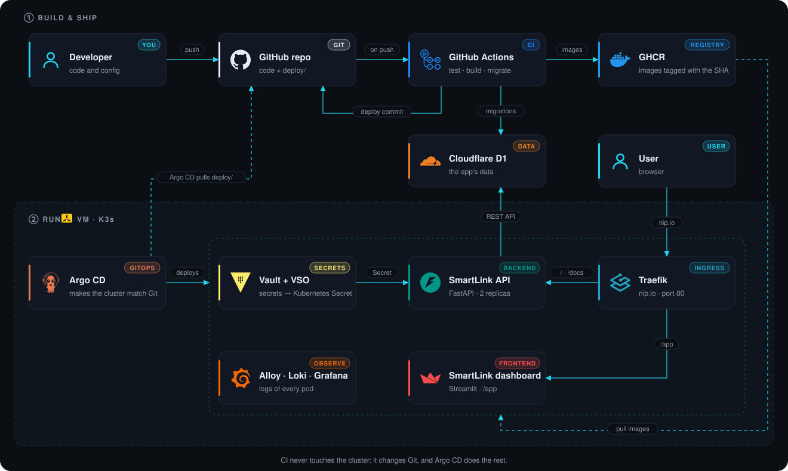

🌐 [Leer en español](es/architecture.md) · 📖 [Docs index](README.md)

# 🏗 How it works

**What each piece does, and what it does not.** The hands-on detail is in each lab.



## The `deploy/` folder

One folder per component, with everything it needs inside: the pattern of [Argo CD's Git generator](https://argo-cd.readthedocs.io/en/stable/operator-manual/applicationset/Generators-Git/) and of projects like [Phalanx](https://phalanx.lsst.io/).

```text
deploy/
├── root/                       ApplicationSet + AppProject + global settings (values.yaml)
└── components/
    ├── argocd/                 Chart.yaml (argo-cd, version) · values.yaml · templates/ui-route.yaml
    ├── vault/                  Chart.yaml (vault) · values.yaml · templates/ui-route.yaml
    ├── traefik/                Chart.yaml · values.yaml (its config) · templates/ (HelmChartConfig, ui-route)
    ├── vault-secrets-operator/ Chart.yaml · values.yaml
    ├── loki/  alloy/           Chart.yaml · values.yaml
    ├── grafana/                Chart.yaml · values.yaml · templates/ (Vault, ui-route)
    ├── smartlink-backend/      Chart.yaml · values.yaml (image) · templates/
    └── smartlink-frontend/     Chart.yaml · values.yaml (image) · templates/
```

- **One rule:** folder = Application = namespace. The **ApplicationSet** creates them: adding a component means adding a folder.
- **Third-party charts:** the `Chart.yaml` declares the official chart as a dependency, with its version; the values go under its name (`vault:`, `grafana:`…).
- **AppProject `smartlink`**, not `default`: only this repo and the official chart repos, and only SmartLink's namespaces.

## Versions

| What | Where | Applied by |
| --- | --- | --- |
| Each chart (Argo CD, Vault, Loki…) | `deploy/components/<x>/Chart.yaml` | Argo CD, with a commit |
| The app (images) | `deploy/components/smartlink-*/values.yaml` | CI, on every deploy |
| K3s and Helm | `deploy/root/values.yaml` (`bootstrap`) | The scripts |

## Responsibilities

| Component | Manages | Does not manage |
| --- | --- | --- |
| **scripts/** | K3s, Argo CD, the D1 database, Vault init: the bootstrap | What runs in the cluster afterwards |
| **Traefik** (ships with K3s) | The only way in: sends each request on port 80 to the right Service, by path or host ([more](traefik.md)) | TLS (none yet), the app's logic |
| **Argo CD** | Everything running in K3s, from Git | Cloudflare, Vault keys |
| **GitHub Actions** | Tests, images, migrations, commit in `deploy/` | The cluster API |
| **Vault + VSO** | Configuration and secrets → Kubernetes Secret | App data |
| **D1** | App data | — |

## Decisions

| Topic | Decision | Why | Lab |
| --- | --- | --- | --- |
| App | Stateless API; data in D1 over REST | Replaceable pods; 2 replicas | [01](labs/01-application.md) |
| Schema | Additive migrations, before the deploy | A new app never runs against an old schema | [02](labs/02-d1.md) |
| Images | Non-root, read-only, amd64 + arm64, tag = SHA | Safe and traceable | [03](labs/03-docker.md) |
| Cluster | One namespace per component; Traefik rules without the IP (nip.io) | Separate permissions; the same config works on any VM | [04](labs/04-k3s.md) |
| Bootstrap | Idempotent scripts, pinned versions | Only what GitOps cannot install by itself | [05](labs/05-scripts.md) |
| GitOps | ApplicationSet: one folder per component; official charts as dependencies | Adding a component = adding a folder; the repo URL is a value | [06](labs/06-argocd.md) |
| Secrets | Vault + VSO; init by script, keys outside the cluster | The app only sees a Secret | [07](labs/07-vault.md) |
| CI | CI writes to Git, never to the cluster | The K3s API is not exposed | [08](labs/08-github-actions.md) |
| Deploy | Only the image changes, in `deploy/components/smartlink-*/values.yaml` | One-line diff, easy to revert | [09](labs/09-gitops.md) |
| TLS | None for now: HTTP on the local network | A private IP cannot get a trusted certificate: Let's Encrypt has to reach the host | [10](labs/10-dns-ingress.md#why-is-there-no-tls-yet) |
| Logs | `key=value`, few labels in Loki | Queryable and cheap | [11](labs/11-observability.md) |

Where each decision comes from: [References](references.md).
