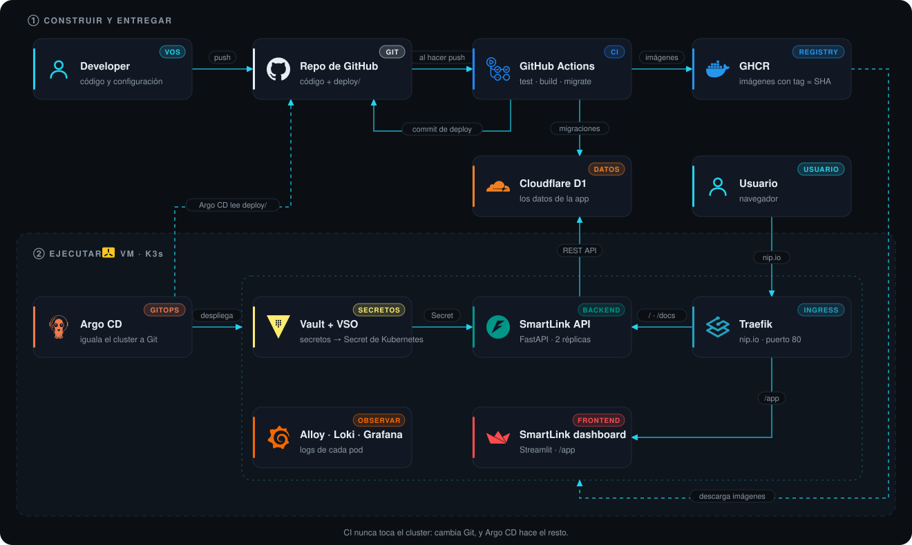

🌐 [Read in English](../architecture.md) · 📖 [Índice](README.md)

# 🏗 Cómo funciona

**Qué hace cada pieza y qué no hace.** El detalle práctico está en cada lab.



## La carpeta `deploy/`

Una carpeta por componente, con todo lo suyo adentro: el patrón del [Git generator de Argo CD](https://argo-cd.readthedocs.io/en/stable/operator-manual/applicationset/Generators-Git/) y de proyectos como [Phalanx](https://phalanx.lsst.io/).

```text
deploy/
├── root/                       ApplicationSet + AppProject + settings globales (values.yaml)
└── components/
    ├── argocd/                 Chart.yaml (argo-cd, versión) · values.yaml · templates/ui-route.yaml
    ├── vault/                  Chart.yaml (vault) · values.yaml · templates/ui-route.yaml
    ├── traefik/                Chart.yaml · values.yaml (su config) · templates/ (HelmChartConfig, ui-route)
    ├── vault-secrets-operator/ Chart.yaml · values.yaml
    ├── loki/  alloy/           Chart.yaml · values.yaml
    ├── grafana/                Chart.yaml · values.yaml · templates/ (Vault, ui-route)
    ├── smartlink-backend/      Chart.yaml · values.yaml (imagen) · templates/
    └── smartlink-frontend/     Chart.yaml · values.yaml (imagen) · templates/
```

- **Una regla:** carpeta = Application = namespace. El **ApplicationSet** las crea solo: agregar un componente es agregar una carpeta.
- **Charts de terceros:** el `Chart.yaml` declara el chart oficial como dependencia, con su versión; los values van bajo su nombre (`vault:`, `grafana:`…).
- **AppProject `smartlink`**, no `default`: solo este repo y los repos de charts oficiales, y solo los namespaces de SmartLink.

## Versiones

| Qué | Dónde | Quién lo aplica |
| --- | --- | --- |
| Cada chart (Argo CD, Vault, Loki…) | `deploy/components/<x>/Chart.yaml` | Argo CD, con un commit |
| La app (imágenes) | `deploy/components/smartlink-*/values.yaml` | CI, en cada deploy |
| K3s y Helm | `deploy/root/values.yaml` (`bootstrap`) | Los scripts |

## Responsabilidades

| Componente | Administra | No administra |
| --- | --- | --- |
| **scripts/** | K3s, Argo CD, base D1, init de Vault: el bootstrap | Lo que corre en el cluster después |
| **Traefik** (viene con K3s) | La única entrada: manda cada request del puerto 80 al Service correcto, por path o por host ([más](traefik.md)) | TLS (todavía ninguno), la lógica de la app |
| **Argo CD** | Todo lo que corre en K3s, desde Git | Cloudflare, llaves de Vault |
| **GitHub Actions** | Tests, imágenes, migraciones, commit en `deploy/` | La API del cluster |
| **Vault + VSO** | Configuración y secretos → Secret de Kubernetes | Datos de la app |
| **D1** | Datos de la app | — |

## Decisiones

| Tema | Decisión | Por qué | Lab |
| --- | --- | --- | --- |
| App | API stateless; datos en D1 por REST | Pods reemplazables; 2 réplicas | [01](labs/01-application.md) |
| Schema | Migraciones aditivas, antes del deploy | App nueva nunca contra schema viejo | [02](labs/02-d1.md) |
| Imágenes | Sin root, read-only, amd64 + arm64, tag = SHA | Seguras y trazables | [03](labs/03-docker.md) |
| Cluster | Un namespace por componente; reglas de Traefik sin IP (nip.io) | Permisos separados; la misma config sirve en cualquier VM | [04](labs/04-k3s.md) |
| Bootstrap | Scripts idempotentes, versiones fijas | Solo lo que GitOps no puede instalarse a sí mismo | [05](labs/05-scripts.md) |
| GitOps | ApplicationSet: una carpeta por componente; charts oficiales como dependencia | Agregar un componente = agregar una carpeta; la URL del repo es un value | [06](labs/06-argocd.md) |
| Secretos | Vault + VSO; init por script, llaves fuera del cluster | La app solo ve un Secret | [07](labs/07-vault.md) |
| CI | CI escribe en Git, nunca en el cluster | La API de K3s no se expone | [08](labs/08-github-actions.md) |
| Deploy | Solo cambia la imagen en `deploy/components/smartlink-*/values.yaml` | Diff de una línea, fácil de revertir | [09](labs/09-gitops.md) |
| TLS | Ninguno por ahora: HTTP en la red local | Una IP privada no puede obtener un certificado de confianza: Let's Encrypt tiene que llegar al host | [10](labs/10-dns-ingress.md#por-qué-no-hay-tls-todavía) |
| Logs | `key=value`, pocos labels en Loki | Consultables y baratos | [11](labs/11-observability.md) |

De dónde sale cada decisión: [Referencias](references.md).
