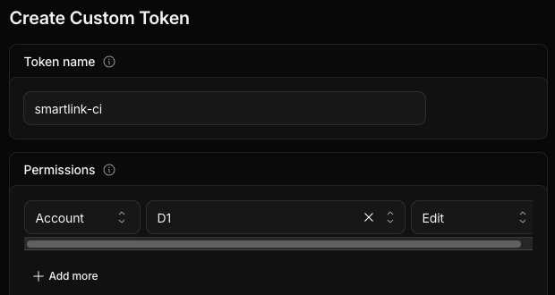
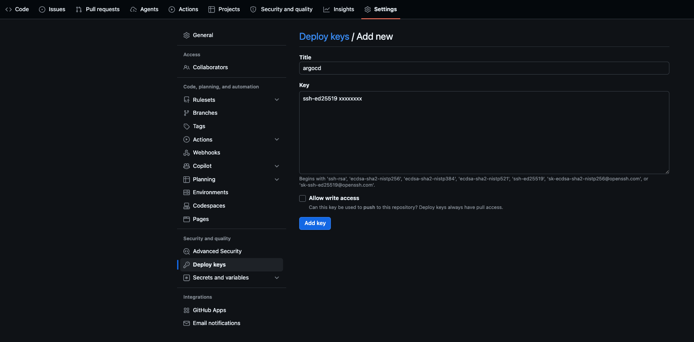

🌐 [Read in English](../install.md) · 📖 [Índice](README.md)

# 🚀 Instalación

**Un comando, y el script te guía.** Te dice qué hacer en cada web (con el link), verifica que esté bien y espera. Si cortás, volvé a correrlo: retoma donde quedó.

## 1. Antes de empezar

- [ ] Cuentas de **GitHub** y **Cloudflare**, y un **gestor de contraseñas**.
- [ ] Dónde correrlo: una **VM Ubuntu 24.04** (2 vCPU, 4 GB, 30 GB, usuario con `sudo`) o tu **Mac**, que crea la VM sola con Multipass. K3s necesita Linux.
- [ ] Tu copia del repo en GitHub:
  - **Público:** hacé un fork del repo.
  - **Privado:** *New repository* → **Private**, vacío, y copiá el historial (un fork no puede ser privado):

    ```bash
    git clone --bare https://github.com/<repo-original>/smartlink.git
    cd smartlink.git && git push --mirror git@github.com:<usuario>/<repo>.git && cd .. && rm -rf smartlink.git
    ```

## 2. Correr el instalador

### En una VM Ubuntu

```bash
ssh -A <usuario>@<ip-vm>     # -A: el clone privado usa tu llave SSH, sin copiarla
git clone git@github.com:<usuario>/<repo>.git ~/smartlink && cd ~/smartlink   # público: https://...
./scripts/install.sh
```

### En una Mac

```bash
git clone git@github.com:<usuario>/<repo>.git && cd <repo>
./scripts/install.sh         # instala Multipass, crea la VM, copia el repo y sigue adentro
```

Después: `./scripts/install.sh shell` para entrar a la VM, `./scripts/install.sh ip` para su IP.

Primero te muestra el repo que detectó en el clon (`git remote origin`) y te pide confirmar que es **tuyo**: Argo CD va a desplegar desde ahí y CI va a correr ahí. Si clonaste el original en vez de tu fork, ahí lo corregís.

El recorrido, en 7 etapas, y al final **todos tus accesos**:

| # | Etapa | Qué hacés vos |
| --- | --- | --- |
| 1 | Cloudflare | Crear un token `D1 › Edit` y pegarlo. Se valida al momento |
| 2 | GitHub (opcional) | Crear un **token fine-grained de 1 día**, solo para tu repo, y pegarlo. Con él, el script carga la deploy key, la variable, el secret, habilita Actions y lanza CI. Sin él, te guía con links |
| 3 | K3s y Argo CD | Sin token: agregar en GitHub la **deploy key** que muestra |
| 4 | Base D1 | Nada (o el Account ID, si no lo deduce del token) |
| 5 | Vault | Nada |
| 6 | Primer deploy | Con token: mirar CI desde la terminal. Sin token: cargar variable y secret, y lanzar CI en la web |
| 7 | Imágenes y prueba | Privado: crear un **token de GitHub** con solo `read:packages`, para que K3s pueda descargar las imágenes privadas de GHCR. Público: hacer públicas las imágenes. Termina con la app respondiendo |
| ✔ | Accesos | Copiar al gestor lo que muestra: URLs, usuarios, passwords de Argo CD y Grafana, unseal key y root token. Al escribir `saved`, borra las llaves de la VM |

> [!NOTE]
> **El token de la etapa 2**
>
> *Fine-grained*, vence en 1 día y solo sirve para tu repo, con permisos de Actions, Administration, Secrets y Variables. **No** puede tocar el código (*Contents*). Vive en memoria mientras corre el instalador: no se guarda en la VM ni en ningún lado.





Lo no secreto (repo, Account ID, ID de D1, IP) lo guarda el instalador en `scripts/config.env` **dentro de la VM** (`~/smartlink/scripts/config.env`). El archivo no está en el repo: Git lo ignora, así que nunca llega a un fork. Para verlo: `./scripts/install.sh shell` y `cat ~/smartlink/scripts/config.env`. Los tokens no se guardan. Qué hace cada script por dentro: [Lab 05](labs/05-scripts.md).

## 3. Usar SmartLink

Todo queda en tu red. El final del instalador (y `./scripts/install.sh access`) muestra:

| | URL | Login |
| --- | --- | --- |
| SmartLink | `http://<ip>/app` | Creás tu cuenta |
| API docs | `http://<ip>/docs` (Swagger) · `http://<ip>/redoc` | Token de `/auth/login` en *Authorize* |
| Argo CD | `http://argocd.<ip>.nip.io` | `admin` + password del resumen final |
| Grafana | `http://grafana.<ip>.nip.io` | `admin` + password del resumen final |
| Vault | `http://vault.<ip>.nip.io` | Método *Token* + root token |
| Traefik | `http://traefik.<ip>.nip.io` | Ninguno: panel de solo lectura de las rutas |

[nip.io](https://nip.io) traduce `argocd.<ip>.nip.io` a `<ip>`: no hay que configurar DNS ([Lab 10](labs/10-dns-ingress.md)).

> [!NOTE]
> **Solo HTTP, en tu red local.** No hay TLS, así que no expongas esta VM a Internet tal como está. Por qué, y cómo se agregaría: [Lab 10](labs/10-dns-ingress.md#por-qué-no-hay-tls-todavía).

1. Abrí `http://<ip>/app` y creá una cuenta.
2. Pegá una URL larga, opcionalmente con un alias, y tocá **Shorten**.
3. Abrí el link corto: redirige y suma un click en el dashboard.

## 4. Correr comandos en el cluster

`kubectl` vive **adentro de la VM**: no hay kubeconfig para copiar ni mezclar, y tu propio `kubectl` y sus contextos no se tocan. En la VM hay dos atajos, y el instalador los deja listos en cada shell nuevo:

| Atajo | Ejecuta | Ejemplo |
| --- | --- | --- |
| `k` | `kubectl` contra el K3s de SmartLink | `k get pods -A` |
| `v` | el CLI `vault` dentro del pod de Vault | `v status` |

**Desde tu Mac, un comando por vez** (no hay que instalar ni configurar nada):

```bash
./scripts/install.sh k get pods -A
./scripts/install.sh k -n smartlink-backend logs deploy/smartlink-api --tail=20
./scripts/install.sh v status
```

**O abrí un shell en la VM** y trabajá ahí, con `k` y `v` listos:

```bash
./scripts/install.sh shell
k get nodes
```

**En una VM o servidor Linux**, conectate con `ssh <usuario>@<ip-vm>` y usá `k` y `v` directo (o `./scripts/install.sh k ...` desde el repo clonado).

`v` necesita login para leer o escribir secretos (`v status` no):

```bash
printf '%s' "<root-token>" | v login -
```

Los labs y las fallas de Break the Platform usan `k` y `v` exactamente así.

---

## Día a día

Todo funciona igual desde tu Mac o desde adentro de la VM.

**Después de reiniciar la VM**

```bash
./scripts/install.sh unseal
```

Vault arranca sellado después de cada reinicio. Mientras tanto la app sigue andando, con el último Secret.

**Ver URLs, usuarios y passwords**

```bash
./scripts/install.sh access
```

Pide el root token de Vault (está en tu gestor de contraseñas).

**Cambiar un secreto (por ejemplo, el token de Cloudflare)**

```bash
./scripts/install.sh secrets
```

**Desplegar un cambio**

```bash
git pull && git push
```

CI también hace commits en `main` (los de deploy): por eso, primero `pull`.

**Volver atrás el último deploy**

```bash
git log --oneline -- deploy/components | head -3
git revert --no-edit <hash> && git push
```

Buscá el commit `deploy: smartlink <sha>` que querés deshacer. Más en el [lab de rollback](labs/12-rollback.md).

**Actualizar un componente — `deploy/components/<componente>/Chart.yaml`**

```yaml
dependencies:
  - name: vault
    version: 0.34.1
```

Cambiala, hacé commit y push: Argo CD lo actualiza. En Vault, además: `k -n vault delete pod vault-0` y unseal.

**Desinstalar**

```bash
./scripts/uninstall.sh
```

Pide escribir `delete`. En macOS borra la VM entera. Cloudflare y GitHub quedan: el script lista qué borrar a mano.

¿Algo no anda? → [Troubleshooting](troubleshooting.md)

---

## Referencia

### Público o privado

| | Público | Privado |
| --- | --- | --- |
| Copia del repo | Fork | Repo nuevo + `git push --mirror` (un fork no puede ser privado) |
| URL que usa Argo CD | HTTPS | SSH + deploy key (la genera `02-argocd.sh`) |
| Imágenes GHCR | Paquetes públicos | Privados + `install.sh ghcr` |

### Forkear este lab

**Qué hereda un fork.** Solo las líneas de la imagen que escribe CI en `deploy/components/smartlink-backend/values.yaml` y `smartlink-frontend/values.yaml` (`repository` y `tag`). El instalador detecta que esa imagen no es tuya (`ghcr.io/<vos>/…`) y lanza CI, que la reemplaza por la tuya en su primera corrida. Nada más está atado al autor: `scripts/config.env` está ignorado por Git, no hay secretos en el repo ni en su historial, y la URL del repo, el ID de D1 y las IPs se deciden al instalar.

**Si publicás tu propia copia como plantilla**, antes volvé esas líneas al placeholder, para que nadie arranque desde tu imagen:

```bash
sed -i.bak -e 's|^  repository: .*|  repository: ghcr.io/set-by-ci/smartlink-api|' -e 's|^  tag: .*|  tag: "0000000"|' deploy/components/smartlink-backend/values.yaml
sed -i.bak -e 's|^  repository: .*|  repository: ghcr.io/set-by-ci/smartlink-frontend|' -e 's|^  tag: .*|  tag: "0000000"|' deploy/components/smartlink-frontend/values.yaml
rm deploy/components/smartlink-*/values.yaml.bak
```

**Antes de hacer público un repo**, cerrá lo que GitHub deja abierto por defecto. Todo está en *Settings* del repo:

| Dónde | Qué configurar |
| --- | --- |
| *Actions › General* | **Plantilla pública:** *Disable Actions* (no corre CI; cada uno corre el suyo). **El repo donde corrés el lab:** dejalas prendidas, permitiendo solo acciones de GitHub y `docker/*`. En los dos: workflows de pull requests de forks → *Require approval for all external contributors*; permisos del workflow → *Read*; destildá *Allow GitHub Actions to create and approve pull requests* |
| *General › Features* | Apagá Wikis, Projects y Discussions si no los vas a usar |
| *Code security* | Activá Dependabot (alertas y actualizaciones de seguridad), **Secret scanning**, **Push protection** y el reporte privado de vulnerabilidades |
| *Rules › Rulesets* | Protegé la rama por defecto contra force-push y borrado. **No** exijas pull requests: CI commitea directo a `main` |
| *Secrets and variables*, *Deploy keys*, *Pages*, *Collaborators* | Una plantilla pública no debería tener ninguno: sacá el secret y la variable de Cloudflare, la deploy key `argocd` y a quien no necesites |

> [!NOTE]
> **Separá tu lab en marcha de tu plantilla publicada.** CI commitea el tag nuevo en el repo que corre el lab, así que el repo desde el que instalás siempre va a tener *tu* tag. Instalá desde una copia privada y publicá una limpia.

### Dónde vive cada credencial

| Credencial | Vive en | La usa |
| --- | --- | --- |
| Token Cloudflare (`D1 › Edit`) | Secret de GitHub `CLOUDFLARE_API_TOKEN` y Vault, `secret/smartlink/backend` | CI (migraciones) y backend. Para separarlos, creá dos tokens y cargá uno en cada lado |
| Password de Grafana | Vault, `secret/grafana` | Grafana |
| Deploy key (privado) | Secret `repo-smartlink` en `argocd` | Argo CD |
| Token GHCR (privado) | `/etc/rancher/k3s/registries.yaml` | K3s |
| Unseal key + root token | Tu gestor de contraseñas | Vos |
